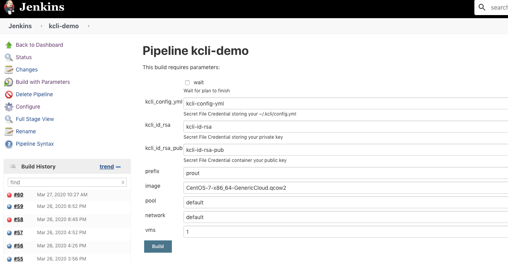

# kcli-jenkins-demo repository


This repository provides an example of how to run a Kcli plan from Jenkins.

## Requisites

- Jenkins running somewhere, either:
   - standalone
   - on K8s/Openshift
- Docker running if using this backend
- Podman installed if using this backend

## How to

### Credentials

First, create the following credentials in Jenkins as secret files:

- kcli-config with the content of your ~/.kcli/config.yml
- kcli-id-rsa with your ssh private key
- kcli-id-rsa-pub with your ssh public key

You can use arbitrary names for those credentials, but you will then have to either edit Jenkinsfile later or specify credentials when running your build.

### Kcli configuration

Default backend is *podman* . If you want to use docker or kubernetes instead, add the corresponding snippet in *~/.kcli/config.yml*.

For instance, for Kubernetes:

```
jenkinsmode: kubernetes
```

### Create Jenkins file

Now you can create a Jenkinsfile from default *kcli_plan.yml*

```
kcli create pipeline
```

You can see an example of the generated Jenkinsfile for both targets from the sample plan provided in this directory.

Parameters from the plan get converted in Jenkins parameters, along with extra parameters for the credentials and with a `wait` boolean to indicated whether to wait for plan completion upon run.

Your Jenkinsfile is ready for use!

## Openshift

You can create credentials as secrets and tag them so they get synced to Jenkins:

```
oc create secret generic kcli-config-yml --from-file=filename=config.yml
oc annotate secret/kcli-config-yml jenkins.openshift.io/secret.name=kcli-config-yml
oc label secret/kcli-config-yml credential.sync.jenkins.openshift.io=true

oc create secret generic kcli-id-rsa --from-file=filename=~/.ssh/id_rsa
oc annotate secret/kcli-id-rsa jenkins.openshift.io/secret.name=kcli-id-rsa
oc label secret/kcli-id-rsa credential.sync.jenkins.openshift.io=true

oc create secret generic kcli-id-rsa-pub --from-file=filename=$HOME/.ssh/id_rsa.pub
oc annotate secret/kcli-id-rsa-pub jenkins.openshift.io/secret.name=kcli-id-rsa-pub
oc label secret/kcli-id-rsa-pub credential.sync.jenkins.openshift.io=true
```

You will also need to allow *anyuid* scc for kcli pod, which can be done with the following command (adjust to your project):

```
PROJECT=kcli
oc adm policy add-scc-to-user anyuid system:serviceaccount:$PROJECT:default
```
## Cool picture



## Copyright

Copyright 2017 Karim Boumedhel

Licensed under the Apache License, Version 2.0 (the "License");
you may not use this file except in compliance with the License.
You may obtain a copy of the License at

    http://www.apache.org/licenses/LICENSE-2.0

Unless required by applicable law or agreed to in writing, software
distributed under the License is distributed on an "AS IS" BASIS,
WITHOUT WARRANTIES OR CONDITIONS OF ANY KIND, either express or implied.
See the License for the specific language governing permissions and
limitations under the License.

## Problems?

There are more important things happening those days :)

Mac Fly!!!

karmab
